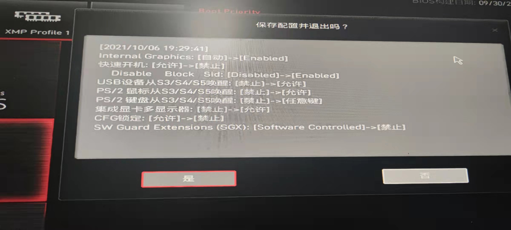

# Hackintosh-MSI-Z490-GAMING-CARBON-WIFI-i7-10700K

## 介绍  
Hackintosh-MSI-Z490-GAMING-CARBON-WIFI-i7-10700K  

## 说明  
MSI-Z490-GAMING-CARBON-WIFI 的黑苹果 EFI  
BIOS是最新版本
MAC版本：BigSur 11.6
OpenCore：7.4
USB：已定制
已定制：主板后4USB3.0,+2USB2.0，机箱前置2USB3.0
未定制：主板TYPE-C，机箱TYPE-C，限制的15个口不够用

## 配置  
 规格     | 详细信息
 ---------|--------
 主板     | 微星 MEG Z490 GAMING CARBON WIFI
 处理器   | 英特尔 Core i7-10700K @ 3.80GHz 八核
 内存     | 16 GB ( 金士顿 DDR4 3600MHz 8*2 )
 硬盘     | 西部黑盘 SN750 1TB ( 1 TB / 固态硬盘 )
 显卡     | 核显
 无线网卡  | 英特尔® Wi-Fi 6 AX201 ( 板载 )
 声卡     | Realtek ALC S1220A
 触摸板   |
 触摸屏   |

## BIOS
恢复默认值后，根据图片修改即可。
    

## 使用
 1. 有线网卡：  最新版本无需修改速度。 

 2. 无线网卡 & 蓝牙：  无线网卡可用，蓝牙未测试。

 3. 显示器声音控制软件：MonitorControl  
	https://github.com/MonitorControl/MonitorControl
 
## 预览
  
  
## 鸣谢
https://bbs.pcbeta.com/forum.php?mod=viewthread&tid=1903518  
https://github.com/wjz304/Hackintosh-EFI-MSI-Z490i-Unify  
https://apple.sqlsec.com/  
https://oc.skk.moe/  
https://dortania.github.io/OpenCore-Install-Guide/   

